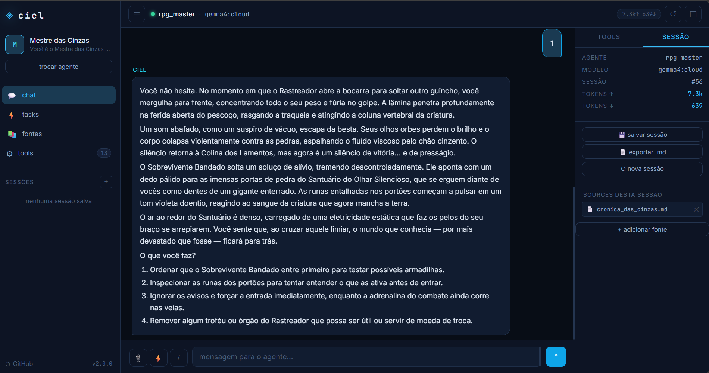
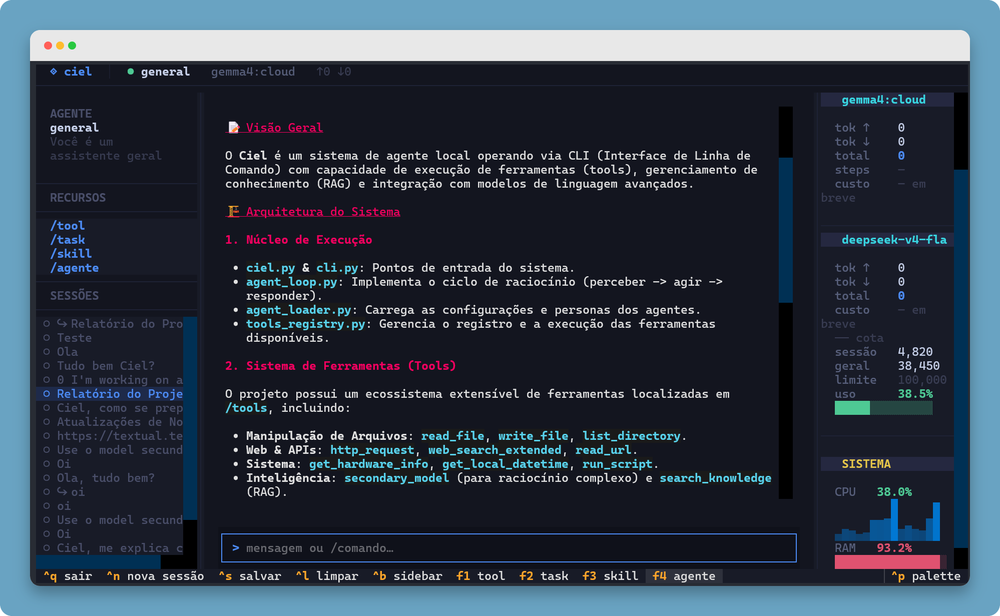
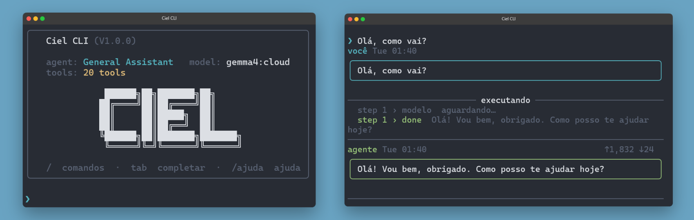
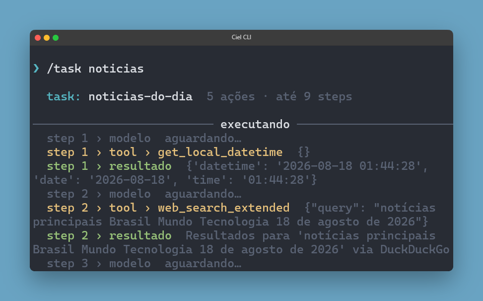
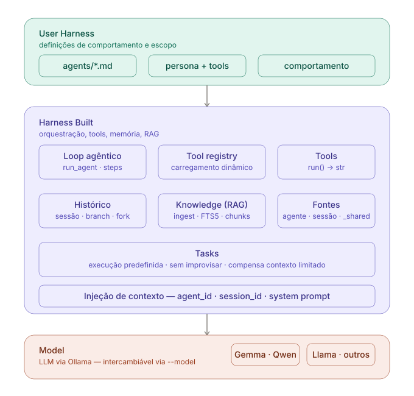

# Ciel CLI

CLI agêntica para automação de tarefas via linguagem natural, com suporte a modelos locais (Ollama) e cloud. Janela de contexto otimizada, base de conhecimento por sessão e tools extensíveis.

Cada **persona** é um arquivo `.md` em `/agents/` — troque o comportamento do agente sem mudar código.

> **Aviso de segurança:** este projeto permite que o agente execute scripts Python e instale pacotes via pip. Use sempre dentro de um `venv` e considere a flag `--safe` se não confiar no modelo ou no input. Veja [Segurança](#segurança) antes de começar.

## 🌐 Versão Server Local

O **CIEL Server** oferece uma interface web para executar o CIEL localmente através do navegador. Ele mantém os mesmos recursos da CLI — agentes, tasks, ferramentas, fontes e sessões — em uma interface mais prática e acessível.

O servidor roda no computador e pode ser acessado localmente ou por outros dispositivos na mesma rede:

```text
http://127.0.0.1:5000
http://192.168.x.x:5000
```

Assim, você pode executar o CIEL no PC e utilizá-lo também pelo celular ou outro dispositivo, sem abrir mão do processamento local.



## 🖥️ Versão TUI (opcional)

O **Ciel TUI** é uma interface de terminal interativa construída com [Textual](https://github.com/Textualize/textual), projetada para quem prefere trabalhar no terminal com mais conforto visual — sem abrir mão da velocidade do CLI.



A TUI mantém todos os recursos do CLI e adiciona navegação por teclado, painéis interativos e feedback visual em tempo real. É uma dependência opcional — o CLI continua funcionando normalmente sem ela.

**Dependência extra:**

```bash
pip install textual
```

**Executar:**

```bash
python ciel.py                         # abre TUI automaticamente se Textual instalado
python ciel.py --tui                   # força TUI
python ciel.py --tui --agent dev_helper
```

**Atalhos principais:**

| Tecla | Ação |
|---|---|
| `Ctrl+K` | Abre editor do conteúdo colado (pill) |
| `Ctrl+G` | Confirma edição no pill |
| `Ctrl+D` | Deleta o pill |
| `Ctrl+S` | Salva sessão |
| `Ctrl+N` | Nova sessão |
| `Ctrl+B` | Alterna sidebar |
| `Ctrl+Y` | Modo seleção — copia trechos do chat |
| `Ctrl+L` | Limpa o chat |
| `F1`–`F4` | Tool / Task / Skill / Agente |
→ **[Documentação completa: docs/tui.md](docs/tui.md)**

## Instalação

> Primeira vez? Siga o **[tutorial passo a passo](docs/tutorial.md)** — do zero ao primeiro chat.

```bash
# 1. Crie e ative um ambiente virtual (recomendado)
python -m venv venv

# Windows
venv\Scripts\activate.bat        # Prompt de Comando
venv\Scripts\Activate.ps1        # PowerShell

# Linux/macOS
source venv/bin/activate

# 2. Instale as dependências
pip install requests rich pymupdf

# 3. Ollama rodando em localhost:11434
```

> Usar `venv` é especialmente importante neste projeto: o agente pode criar tools dinamicamente
> e instalar pacotes via pip. Sem isolamento, isso afeta seu Python global.

## Uso



```bash
python cli.py                             # agente padrão (general)
python cli.py --agent general             # agente geral
python cli.py --agent dev_helper          # focado em scripts Python
python cli.py --agent researcher          # leitura e síntese de arquivos
python cli.py --agent general --safe      # sem tools de execução arbitrária
python cli.py --model gemma4:cloud        # outro modelo Ollama
python cli.py --list-agents               # lista personas disponíveis
python server.py                          # versão server local
```

## Comandos da CLI

| Comando                        | Ação                                              |
|-------------------------------|---------------------------------------------------|
| `/tools`                      | lista tools ativas nessa sessão                   |
| `/agente <nome>`              | troca de persona sem reiniciar                    |
| `/novo`                       | inicia nova sessão                                |
| `/limpar`                     | limpa o histórico de exibição                     |
| `/history`                    | gerencia sessões salvas (ver, retomar, branch)    |
| `/source <arquivo>`           | indexa arquivo na base de conhecimento            |
| `/source --global <arquivo>`  | indexa como fonte compartilhada do agente         |
| `/source --listar`            | lista fontes disponíveis com IDs                  |
| `/source --remover <id>`      | remove uma fonte pelo ID                          |
| `/source --limpar-orfas`      | remove fontes de sessões deletadas                |
| `/task`                       | lista todas as tasks disponíveis                  |
| `/task <nome>`                | executa task pelo nome (parcial ou exato)         |
| `/task <arquivo.md>`          | executa task pelo caminho direto                  |
| `/mcp`                        | lista servidores MCP conectados e status          |
| `/mcp -v`                     | lista com todas as tools de cada servidor         |
| `/ajuda`                      | exibe todos os comandos disponíveis               |
| `/sair`                       | encerra                                           |

## Sistema de histórico e branches

As sessões são salvas automaticamente e podem ser retomadas a qualquer momento.

```bash
# durante a sessão
/history salvar          # salva e nomeia a sessão atual
/history                 # lista sessões salvas
                         # → r: retomar  b: criar branch  d: deletar
```

Branches criam uma sessão filha que herda o histórico e as fontes da sessão pai —
útil para explorar um caminho diferente sem perder o contexto original.

## Tasks

Tasks são fluxos de execução definidos pelo usuário em arquivos `.md`.
O agente executa as ações em ordem como um inspetor — sem planejar, sem improvisar.

```bash
/task                        # lista todas as tasks disponíveis
/task noticias               # executa pelo nome (parcial ou exato)
/task tasks/minha_task.md    # executa pelo caminho direto
```

Se mais de uma task corresponder ao nome buscado, o agente lista as candidatas e pede para escolher.
<p align="center">
  
</p>

### Modo headless

Tasks podem ser executadas sem abrir o terminal interativo — útil para automações, cron jobs e pipelines.

```bash
python cli.py --task tasks/noticias_do_dia.md
```

O agente executa a task e encerra. Sem prompt, sem sessão interativa.

## Base de conhecimento (fontes)

Indexa arquivos locais para o agente consultar por relevância, sem carregar tudo no contexto.
Suporta `.pdf`, `.txt` e `.md`.

```bash
/source relatorio.pdf              # disponível só nesta sessão
/source --global manual.txt        # disponível em todas as sessões do agente
/source --listar                   # vê IDs e resumos das fontes
/source --remover 3                # remove a fonte de id=3
```

O agente consulta as fontes automaticamente via `search_knowledge`, `list_sources` e `read_source`.
Fontes de sessão são removidas quando a sessão é deletada. Fontes `--global` persistem até remoção explícita.

**Escopos de visibilidade:**

```
_shared       → todas as sessões do agente
session_id    → sessão atual e seus branches
```

## Criando sua própria persona

Crie `agents/meu_agente.md`:

```markdown
# Meu Agente

## Persona
Você é um agente especializado em X...

## Tools permitidas
calculator
read_file
search_knowledge
list_sources

## Comportamento
- Regra 1
- Regra 2
```

Rode com `python cli.py --agent meu_agente`.

### Campos do .md

| Seção                    | Obrigatório | Descrição                                          |
|--------------------------|-------------|----------------------------------------------------|
| `# Título`               | sim         | Nome do agente exibido na CLI                      |
| `## Persona`             | sim         | Personalidade e contexto do agente                 |
| `## Tools permitidas`    | não         | `todas` ou lista de nomes. Padrão: todas           |
| `## Comportamento`       | não         | Regras adicionais de decisão                       |
| `## Formato de resposta` | não         | Override do JSON padrão (avançado)                 |

## MCP — integrações externas

O Ciel suporta o [Model Context Protocol](https://modelcontextprotocol.io), permitindo conectar servidores externos e usar suas ferramentas diretamente no agente — sem modificar código.

```bash
# conectar um servidor (pelo agente ou direto)
mcp_add_server(name="telegram", type="stdio",
               command="python", args="mcp/telegram/server.py",
               env="TELEGRAM_BOT_TOKEN=seu_token")

# verificar servidores conectados
/mcp -v
```

As tools do servidor aparecem automaticamente no registry com namespace `mcp_{servidor}__{tool}` e o agente passa a usá-las como qualquer outra tool. A configuração persiste em `mcp_servers.json` e é recarregada a cada sessão.

O projeto inclui um servidor MCP para **Telegram** (`mcp/telegram/`) pronto para usar. Outros servidores MCP públicos (NPM, PyPI) também funcionam sem adaptação.

→ **[Documentação completa: docs/mcp.md](docs/mcp.md)** · **[Tutorial Telegram: docs/mcp_telegram_tutorial.md](docs/mcp_telegram_tutorial.md)** · **[Tutorial Notion: docs/mcp_notion_tutorial.md](docs/mcp_notion_tutorial.md)**

## Segurança

Este projeto tem duas superfícies de risco que você deve conhecer:

**`run_script`** — executa qualquer arquivo `.py` que o modelo solicitar na sua máquina.
Use `--safe` para desabilitar essa tool:

```bash
python cli.py --agent general --safe
```

Recomendado ao usar modelos menos confiáveis, modelos pequenos propensos a alucinações,
ou ao expor a CLI a inputs externos.

**`create_tool`** — o agente pode criar novas tools dinamicamente e, dependendo do modelo,
pode tentar instalar pacotes via pip como parte desse processo. Por isso o uso de `venv` é
essencial: qualquer instalação fica isolada do seu Python global e pode ser descartada junto
com o ambiente.

Tools criadas dinamicamente ficam em `tools/temp/` e não são versionadas pelo git.

## Estrutura do projeto

```
Ciel/
├── README.md
├── cli.py
├── ciel_tui.py
├── ciel.py
├── agent_loop.py
├── server.py
├── agent_loader.py
├── tools_registry.py
├── history_store.py
├── history_ui.py
├── ciel_config.example.json
├── mcp_servers.json              ← gerado automaticamente
├── telegram_channels.json        ← gerado automaticamente
├── agents/
│   ├── general.md
│   ├── dev_helper.md
│   ├── frontend.md
│   └── rpg_master.md
├── mcp/
│   ├── __init__.py
│   ├── client.py                 ← protocolo JSON-RPC 2.0, stdio/SSE
│   ├── adapter.py                ← converte schemas MCP → ToolRegistry
│   ├── manager.py                ← ciclo de vida dos servidores
│   └── telegram/
│       ├── __init__.py
│       ├── server.py             ← servidor MCP para Telegram (Bot API)
│       └── channels.py           ← cache local de canais
├── tools/
│   ├── calculator.py
│   ├── create_tool.py
│   ├── create_temp_tool.py
│   ├── get_hardware_info.py
│   ├── get_local_datetime.py
│   ├── get_network_info.py
│   ├── http_request.py
│   ├── list_directory.py
│   ├── list_sources.py
│   ├── mcp_add_server.py         ← registra e conecta servidor MCP
│   ├── mcp_list_servers.py       ← lista servidores e status
│   ├── mcp_remove_server.py      ← remove e desconecta servidor
│   ├── read_file.py
│   ├── read_source.py
│   ├── read_url.py
│   ├── run_script.py
│   ├── search_knowledge.py
│   ├── secondary_model.py
│   ├── web_search_extended.py
│   └── write_file.py
├── knowledge/
│   ├── __init__.py
│   ├── db.py
│   ├── ingest.py
│   ├── ingest_url.py
│   └── retriever.py
├── skills/
│   ├── code-review.md
│   ├── data-analysis.md
│   ├── docs-generator.md
│   ├── frontend-visual.md
│   └── refactor.md
├── tasks/
│   ├── iniciar_rpg.md
│   └── noticias_do_dia.md
├── system/
│   ├── core_prompt.md
│   └── tool_template.md
├── prompts/
│   └── web_search.md
├── web/
│   ├── static/
│   │   ├── app.js
│   │   └── style.css
│   └── templates/
│       └── index.html
└── docs/
    ├── KNOWLEDGE_ROADMAP.md
    ├── TESTING.md
    ├── mcp.md                    ← documentação do pacote MCP
    ├── mcp_telegram_tutorial.md  ← tutorial de integração Telegram
    ├── secondary-model.md
    ├── skills.md
    ├── sources.md
    ├── tasks.md
    ├── tools.md
    └── tutorial.md
```

## Arquitetura

<p align="center">
  
</p>

O modelo é intercambiável — o valor está no harness: tool registry dinâmico,
sessões com branch/fork, base de conhecimento por sessão e injeção de contexto otimizada
para janelas pequenas.

Tasks permitem execução predefinida de fluxos complexos — uma forma deliberada de
compensar as limitações de contexto de modelos locais menores sem depender de um
orquestrador grande.

A janela de contexto é otimizada por design: uma sessão típica com tasks,
busca e escrita de arquivos fica em torno de 20k–30k tokens totais,
viabilizando o uso contínuo com modelos locais de janela menor.

## Modelo secundário (opcional)

O CIEL suporta um modelo secundário externo para tarefas que exigem raciocínio
mais complexo ou contexto extenso — sem substituir o orquestrador local.

Quando o orquestrador (Gemma4/Ollama) identifica que o problema está além das
suas capacidades, ele delega via tool `secondary_model` para um modelo externo
configurado pelo usuário. O resultado volta pro orquestrador, que entrega ao usuário.

Funciona com qualquer API OpenAI-compatible: NVIDIA Build (gratuito), OpenRouter,
OpenAI, Anthropic, 9router, ou qualquer provider compatível.

```bash
# 1. Copie o template de configuração
cp ciel_config.example.json ciel_config.json

# 2. Edite com seu provider e chave
{
  "base_url": "https://integrate.api.nvidia.com/v1",
  "model":    "deepseek-ai/deepseek-v4-flash-0731",
  "api_key":  "SUA_CHAVE_AQUI"
}
```

Sem configuração, o CIEL funciona normalmente — o modelo secundário é uma adição,
não uma dependência.

→ **[Documentação completa: docs/secondary-model.md](docs/secondary-model.md)**

## Skills (opcional)

Skills são arquivos `.md` em `skills/` com instruções detalhadas injetadas diretamente no system prompt do modelo secundário — sem passar pelo orquestrador local. Permitem configurar o secundário para domínios específicos com contexto que um modelo pequeno não conseguiria carregar.

```bash
/skill                          # lista skills disponíveis
/skill frontend-visual          # exibe o conteúdo da skill
/skill frontend-visual cria um site de portfólio animado
```

Skills incluídas: `frontend-visual`, `code-review`, `refactor`, `docs-generator`, `data-analysis`.

### Skills integradas ao agente

Skills também podem ser vinculadas diretamente a um agente em seu arquivo `.md`, por nível de prioridade. Quando o agente é carregado, as skills listadas são injetadas automaticamente no system prompt do modelo secundário.

> **Atenção ao contexto:** cada skill adicionada aumenta o número de tokens enviados na chamada ao modelo secundário. Ao usar agentes com skills vinculadas, considere aumentar `max_tokens` em `ciel_config.json` para evitar respostas truncadas — respeitando o limite máximo da API do provider escolhido.

→ **[Documentação completa: docs/skills.md](docs/skills.md)**

## Limitações

- `run_script` executa qualquer `.py` que o modelo solicitar — use `--safe` se não confiar no input.
- `create_tool` pode tentar instalar dependências via pip — use sempre dentro de um `venv`.
- Modelos locais pequenos (< 8B) podem falhar em raciocínio complexo — considere configurar um modelo secundário para esses casos.

---

Posicione como **automação de tarefas pessoais via linguagem natural com modelos locais**,
não como agente geral de propósito irrestrito.